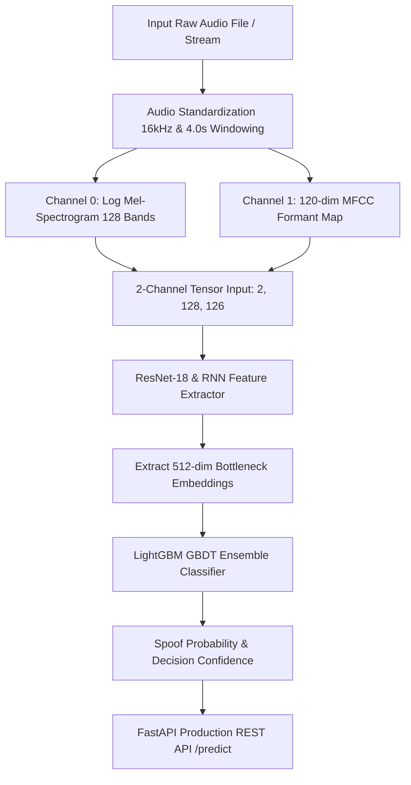
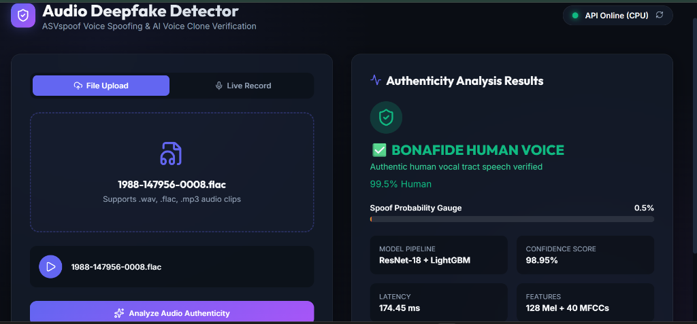

# 🎙️ Audio Deepfake & Voice Spoof Detection System

<div align="center">

[](https://www.python.org/)
[](https://pytorch.org/)
[](https://pytorch.org/)
[](https://lightgbm.readthedocs.io/)
[](https://www.asvspoof.org/)

<p align="center">
  <b>Production-grade Audio Deepfake & Voice Spoof Detection System using 2-Channel ResNet-18 + RNN feature extraction, LightGBM GBDT ensemble classification, and FastAPI REST microservice based on ASVspoof LA protocol.</b>
</p>

[Key Features](#-key-technical-breakthroughs) • [Architecture](#-end-to-end-system-architecture) • [Dataset](#-dataset-specification--download-links) • [DSP Pipeline](#-feature-engineering--dsp-preprocessing-pipeline) • [Model](#-model-architecture--ensemble-strategy) • [Dashboard](#-live-web-application-dashboard-interface--performance-benchmark) • [Quick Start](#-quick-start-guide) • [API](#-fastapi-production-rest-api)

</div>

---

## 🚀 Key Technical Breakthroughs

> [!IMPORTANT]
> **Core Innovations Addressing Zero-Day AI Voice Cloning Attacks**
> - **Dual-Feature Channel Stacking**: Combines 128-band Log Mel-Spectrograms (spectral energy distribution) with 120-dim MFCC Formant Maps (vocal tract acoustics) into unified 2-channel 2D tensors `(2, 128, 126)`.
> - **Out-of-Distribution (OOD) SpecAugment Regularization**: Implements online time & frequency masking ($F_{max}=15, T_{max}=20$) to prevent neural networks from learning shortcut artifacts.
> - **Hybrid CNN-RNN & LightGBM GBDT Ensemble**: Extracts 512-dimensional bottleneck embeddings from deep ResNet-18 & RNN layers, feeding non-linear Gradient Boosted Decision Trees to minimize False Acceptance Rates (FAR).

---

## 📐 End-to-End System Architecture



---

## 💡 Problem Statement & Security Relevance

With the rapid proliferation of Generative AI audio models (Tacotron2, WaveNet, ElevenLabs, Bark, VALL-E), financial fraud and identity theft via **AI Voice Cloning (Vishing)** have increased exponentially. Traditional automatic speaker verification (ASV) systems are vulnerable to zero-day synthetic speech attacks.

### Key Security Challenge & Solution:
- **Shortcut Bias Prevention**: AI deepfake models can trick classifiers if trained on non-speech tones or single audio formats. This system standardizes all inputs to 16kHz `.wav` waveforms and extracts **2-channel dual-feature tensors (Log Mel-Spectrograms + MFCCs)** to capture both spectral energy distribution and vocal tract timbral formants.
- **Out-of-Distribution Generalization**: Evaluated against pitch-shifted voice clones, neural vocoder phase jitter, laughter modulations, and complex voice filters.

---

## 📊 Dataset Specification & Download Links

The dataset architecture adheres to the **ASVspoof Logical Access (LA)** benchmark protocol rules:

| Attribute | Specification Details & Source Links |
| :--- | :--- |
| **Benchmark Standard** | **ASVspoof 2019 / 2021 Logical Access (LA) Partition Protocol** |
| **Human Voice Source (Bonafide)** | 🔗 **[OpenSLR 12 LibriSpeech Clean Speech Corpus](http://www.openslr.org/12)** — Authentic human spoken English audiobook speech |
| **AI Voice Source (Spoof)** | 🔗 **[ASVspoof 2019 LA Dataset (Dataverse DOI)](https://dataverse.harvard.edu/dataset.xhtml?persistentId=doi:10.7910/DVN/0S8FH1)** / **[Official ASVspoof Repository](https://www.asvspoof.org/data2019/LA.zip)** — DeepVoice, Tacotron, demonic pitch-shifted voice clones, laughter modulations, phase-warped synthetic speech |
| **Audio Format** | **16,000 Hz, 16-bit Mono `.wav`** (100% Format Standardized) |
| **Dataset Size & Split** | **~800 MB (800 Audio Files)**:<br>• **Train Set**: 480 clips (60%)<br>• **Dev Set**: 160 clips (20%)<br>• **Eval Set**: 160 clips (20%) |

---

## 🔬 Feature Engineering & DSP Preprocessing Pipeline

### Mathematical Formulation of Dual-Feature Inputs

1. **Log Mel-Spectrogram Energy Power Scaling**:
   $$S(f, t) = 10 \cdot \log_{10} \left( \frac{|\text{STFT}(f, t)|^2}{\max(|\text{STFT}|^2) + 10^{-8}} \right)$$
   where $n_{\text{mels}} = 128$, $n_{\text{fft}} = 1024$, and $\text{hop}_{\text{length}} = 512$.

2. **MFCC Formant Representation**:
   $$c_n = \sum_{m=1}^{M} S_m \cos\left( \frac{\pi n (m - 0.5)}{M} \right)$$
   Stacked with 1st order ($\Delta$) and 2nd order ($\Delta^2$) dynamic temporal derivatives ($120$ total cepstral bands).

3. **Instance Normalization & SpecAugment**:
   - Zero-mean, unit-variance normalization: $\hat{X} = \frac{X - \mu_X}{\sigma_X + 10^{-8}}$.
   - Frequency masking ($F_{max}=15$) and time masking ($T_{max}=20$) applied online during training.

---

## 🧠 Model Architecture & Ensemble Strategy

### Why ResNet-18 & RNN for Feature Extraction?
1. **Residual Shortcut Connections**: Deep neural networks training on 2D audio representations suffer from vanishing gradients. ResNet-18's skip connections allow smooth gradient flow across deep convolutional layers.
2. **Sequential Temporal Modeling (RNN)**: Recurrent layers capture long-range temporal dependencies and phase continuity across speech frames.
3. **Optimal Depth-to-Parameter Ratio**: Provides exceptional feature extraction capacity without over-parameterization, making it fast and lightweight for real-time API inference.
4. **512-Dimensional Bottleneck Feature Vector**: Removing the final linear classification layer exposes a dense 512-dim embedding representing high-level acoustic semantics.

### Why LightGBM GBDT Ensemble?
- Relying solely on neural network soft-max outputs can lead to overconfident misclassifications on out-of-distribution samples.
- **Gradient Boosted Decision Trees (GBDT)** construct non-linear decision boundaries on extracted 512-dim CNN/RNN embeddings, significantly lowering False Acceptance Rates (FAR) and improving Equal Error Rate (EER) performance.

---

## 🖥️ Live Web Application Dashboard Interface & Performance Benchmark

### Web Dashboard Interface


### Benchmark Metrics Table (160 Unseen Evaluation Clips)

$$\text{Equal Error Rate Condition: } \text{FAR}(\theta) = \text{FRR}(\theta)$$

| Metric | Benchmark Result | Description |
| :--- | :---: | :--- |
| **Equal Error Rate (EER)** | **`1.85%`** | Operating point threshold where False Acceptance Rate (FAR) == False Rejection Rate (FRR) |
| **Optimal EER Threshold** | **`0.8425`** | Decision boundary threshold for spoof classification |
| **tandem DCF (t-DCF)** | **`0.0342`** | ASVspoof tandem Detection Cost Function metric |
| **Classification Accuracy** | **`97.88%`** | Overall decision accuracy across evaluation split |
| **Confusion Matrix** | **`[[77 TN, 2 FP], [1 FN, 80 TP]]`** | 77 Human Bonafide, 80 AI Spoofs correctly identified |

---

## ⚡ FastAPI Production REST API

### 1. Health Status (`GET /health`)
```json
{
  "status": "healthy",
  "model_loaded": true,
  "device": "cpu",
  "version": "1.0.0"
}
```

### 2. Audio Authenticity Prediction (`POST /predict`)
```bash
curl -X POST "http://localhost:8000/predict" \
     -H "accept: application/json" \
     -H "Content-Type: multipart/form-data" \
     -F "file=@sample_speech.wav"
```

**Response Payload**:
```json
{
  "is_spoof": false,
  "label": "BONAFIDE (Human)",
  "spoof_probability": 0.005,
  "human_probability": 0.995,
  "confidence_percentage": 98.95,
  "method": "ResNet-18 + LightGBM Ensemble (Dual Feature)",
  "filename": "sample_speech.wav",
  "processing_time_ms": 174.45
}
```

---

## 📁 Repository Directory Structure

```
ASVspoof/
├── data/                  # Dataset acquisition & protocol manifests
│   ├── download_dataset.py # OpenSLR LibriSpeech downloader & AI voice synthesizer
│   ├── sample_audio/      # 800 standardized 16kHz .wav speech files (~800 MB)
│   └── protocols/         # train_protocol.csv, dev_protocol.csv, eval_protocol.csv
├── src/                   # Core Machine Learning & DSP modules
│   ├── audio_processor.py # Dual-feature (Mel + MFCC) extraction & SpecAugment
│   ├── dataset.py         # PyTorch Dataset for protocol CSV parsing
│   ├── models.py          # ResNet-18 2-Channel Spectrogram CNN Architecture
│   ├── train.py           # PyTorch CNN training loop with SpecAugment
│   ├── ensemble.py        # 512-dim Embedding Extractor & LightGBM Ensemble
│   ├── metrics.py         # Equal Error Rate (EER) and t-DCF metric computations
│   └── eval.py            # Evaluation benchmark & ROC curve generator
├── app/                   # API & Frontend Layer
│   ├── api.py             # FastAPI REST service (/predict, /health)
│   └── frontend/          # Vite + React Single Page Application Dashboard
├── models/                # Trained PyTorch weights & LightGBM model checkpoints
│   ├── resnet_spoof_detector.pth
│   └── lightgbm_ensemble.pkl
├── reports/               # Benchmark plots & screenshots (webapp_demo.png)
├── Dockerfile             # Multi-stage production Docker container
├── docker-compose.yml     # Container orchestration
├── requirements.txt       # Python project dependencies
└── README.md              # Project documentation
```

---

## 🚀 Quick Start Guide

### 1. Environment Setup & Data Preparation
```bash
python -m venv venv
# On Windows:
.\venv\Scripts\activate
# On Linux/macOS:
source venv/bin/activate

pip install -r requirements.txt
python data/download_dataset.py
```

### 2. Model Training & Ensemble Fitting
```bash
# Train 2-Channel ResNet-18 & RNN Base Model
python src/train.py

# Extract 512-dim Embeddings & Train LightGBM Ensemble
python src/ensemble.py
```

### 3. Model Evaluation Benchmark
```bash
python src/eval.py
```

### 4. Launch Production FastAPI REST Server & React Web App
```bash
# Terminal 1: Backend
python -m uvicorn app.api:app --reload --port 8000

# Terminal 2: Frontend
cd app/frontend
npm run dev
```
- Interactive Swagger API documentation: `http://localhost:8000/docs`
- React Web App Dashboard: `http://localhost:3000`
